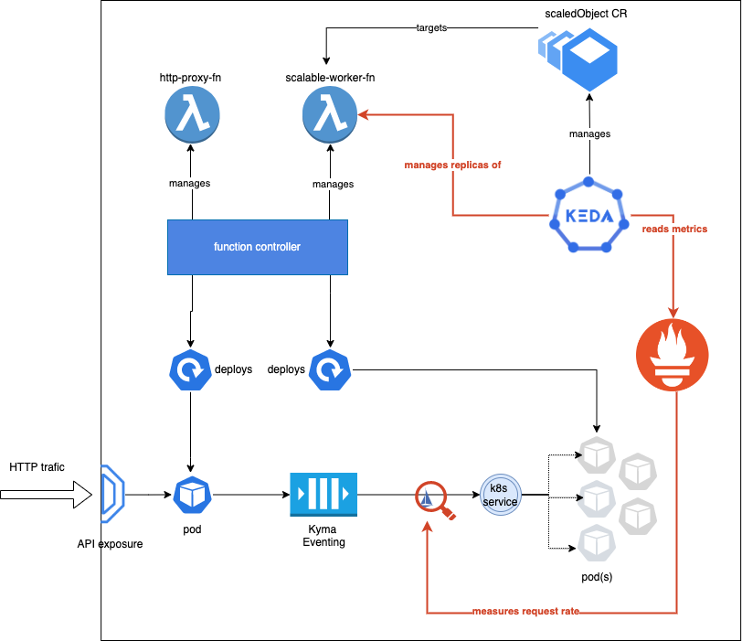

## Overview
This example demostrates a very useful setup utilising 
 - Functions,
 - in-cluster eventing,
 - [Keda](https://keda.sh/) for Function scaling.

It realises the following scenario:



The proxy Function receives incomming http trafic and with every request it publishes the payload as incluster event to a particular topic.

The second Function ( the actual worker ) is subscribed to the topic and processes incomming  messages. But until there are no messages published for it's subscribed topic it remains scaled to zero - there are no actual worker Pods living in the runitme.

Keda is used to scale the worker Function. [KEDA Prometheus scaler](https://keda.sh/docs/2.8/scalers/prometheus/) is used to measure the load targeted for the worker's Function and scale it accordingly ( from 0 to 5 replicas )


## Prerequisites

- Kyma as the target deployment environment.

## Installation

Run the following against your kyma runtime to install KEDA:

```bash
kubectl apply -f https://github.com/kedacore/keda/releases/download/v2.8.0/keda-2.8.0.yaml
```

Make sure istio sidecar injection is enabled in the target namesapce:

```bash
kubectl label ns default istio-injection=enabled
```

Apply the example resources from `./k8s-resources` directory:
```bash
kubectl apply -f ./k8s-resources`
```

## Test the application

At first the worker Function is scaled down.
When listing HPA for the Function you will see that current replica count is at zero.
 ```bash
kubectl get hpa
NAME                               REFERENCE                     TARGETS             MINPODS   MAXPODS   REPLICAS   AGE
keda-hpa-worker-fn-scaled-object   Function/scalable-worker-fn   <unknown>/2 (avg)   1         5         0          27h

 ```
 Also, when listing Pods by Function name label you will see only the build job's Pod. No runtime Pod is up.
 ```bash
kubectl get pods -l serverless.kyma-project.io/function-name=scalable-worker-fn -w
NAME                                   READY   STATUS      RESTARTS   AGE
scalable-worker-fn-build-7s4rf-wjhvt   0/1     Completed   0          2m16s
 ```

Once you generate a load ( even a single request ) the non-zero request ratio for the worker Function will trigger scaling up of the worker Function's runtime Pods

 Call the http proxy Function once 

 ```bash
 curl -H "Content-Type: application/cloudevents+json" -X POST -d '{"foo":"bar"}' https://incoming.{your_cluster_domain}
 ```

The message will be pushed to the kyma eventing.
Ofcourse it takes time to scale up a Function from zero. But no message will be lost as eventing will retry delivering message to subscriber until it is eventually consumed bu a running worker Pod.

Observe worker Function scaling up from 0. You will notice by watching Function Pods or HPA.
```bash
kubectl get pods -l serverless.kyma-project.io/function-name=scalable-worker-fn -w 
NAME                                   READY   STATUS      RESTARTS   AGE
scalable-worker-fn-build-k94qz-ntjmn   0/1     Completed   0          32s
scalable-worker-fn-2n269-6f6d5f675-t6nwr   0/2     Pending     0          0s
scalable-worker-fn-2n269-6f6d5f675-t6nwr   0/2     Pending     0          0s
scalable-worker-fn-2n269-6f6d5f675-t6nwr   0/2     Init:0/1    0          0s
scalable-worker-fn-2n269-6f6d5f675-t6nwr   0/2     Init:0/1    0          0s
scalable-worker-fn-2n269-6f6d5f675-t6nwr   0/2     Init:0/1    0          1s
scalable-worker-fn-2n269-6f6d5f675-t6nwr   0/2     PodInitializing   0          2s
scalable-worker-fn-2n269-6f6d5f675-t6nwr   0/2     Running           0          7s
```
```bash
kubectl get hpa -w                                                        
NAME                               REFERENCE                     TARGETS             MINPODS   MAXPODS   REPLICAS   AGE
keda-hpa-worker-fn-scaled-object   Function/scalable-worker-fn   <unknown>/2 (avg)   1         5         0          27h
keda-hpa-worker-fn-scaled-object   Function/scalable-worker-fn   0/2 (avg)           1         5         1          27h
```

Observe that the payload was eventually processed

See in the worker's Function logs that `Processing ... {"foo":"bar"}` eventually appears:

 ```bash
kubectl logs -l serverless.kyma-project.io/function-name=scalable-worker-fn -f
> nodejs16-runtime@0.1.0 start
> node server.js

user code loaded in 0sec 0.783514ms
Processing ...
{"foo":"bar"}

 ```
 
 If the trafic stops, the worker Function will be scaled down back to zero replicas (after a configurable cooldown period)
 
 If you generate a much higher load (for example > 2 req/sec - as configured in the threshold value of the scaledObject) you will observe scaling up to more replicas. One replica should be added for each additional 2req/sec measured. 